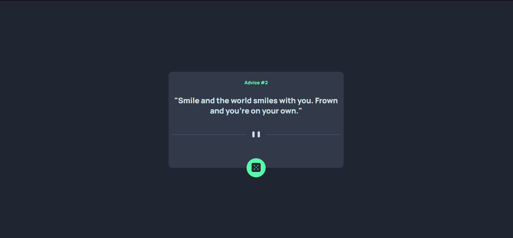
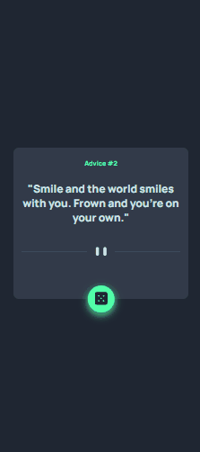

<h1 align="center">App Gerador de Conselhos</h1>
<br>

<p align="center">Meu 2° exercício após começar o curso de developer 😎</p> 
<br>

<div>
    <h3 align="center"><strong>Desktop View</strong><h3>
    <a href="https://thaleshng.github.io/exercicio-app-gerador-de-conselhos/" target="_blank"></a> 
</div>

<div align="center">
    <h3 align="center"><strong>Mobile View</strong><h3>
    <a href="https://thaleshng.github.io/exercicio-app-gerador-de-conselhos/" target="_blank"></a> 
</div>

<div align="center">
    
    
    
    <br>
    
    <br>
    
</div>

<br>


<div aling="center">
    <a href="#tecnologias-utilizadas">Tecnologias Utilizadas</a> •
    <a href="#finalidade-do-projeto">Finalidade do Projeto</a> •
    <a href="#dificuldades-encontradas-e-aprendizados">Dificuldades Encontradas e Aprendizados</a> •
    <a href="#como-ter-acesso-ao-código">Como ter acesso ao Código</a> 
</div>

<br>
<br>

<h2 align="center">Tecnologias Utilizadas</h2>
<br>

[](https://www.devmedia.com.br/o-que-e-o-html5/25820)
<br>
<br>

[](https://kenzie.com.br/blog/css3/)
<br>
<br>

[](https://blog.betrybe.com/javascript/)
<br>
<br>
<br>

<h2 align="center">Finalidade do Projeto</h2>
<br>

<p> O projeto em questão tem como finalidade testar os aprendizados dos módulos de HTML e CSS do curso de developer.</p> 
<p>Foi tomado como base um desafio do Frontend Mentor que gerava um conselho ao clicar no botão, porém, foi dividido em 2 partes sendo a primeira contemplando somente HTML e CSS.</p>
<p>A segunda parte posteriormente, será adicionada a parte de JavaScript do desafio em questão.</p>
<br>
<br>
<br>

<h2 align="center">Dificuldades Encontradas e Aprendizados</h2>
<br>

<p> No geral eu consegui atingir os objetivos que se pediam no exercício, contudo, tive bem menos dificuldade após a conclusão do 1° exercício, observei melhoras na prática do Clean Code e no alinhamento do conteúdo no centro da página.</p>
<p>Quanto à parte de JavaScript também não encontrei maiores dificuldades. Durante o desenvolvimento do projeto pude aplicar os conhecimentos que aprendi nos módulos de JavaScript do curso DevQuest, como consumo de API's; funções assíncronas; entre outros.</p>
<p> Após o projeto finalizado, comparei o meu código ao código da resolução e destaquei os pontos onde podiam ser melhorados, para que os erros não voltem a acontecer nos próximos exercícios.
<br>
<br>
<br>

<h2 align="center">Como ter acesso ao Código<h2>
<br>

### Pré-requisitos:
<br>
Antes de começar, vai precisar ter instalado na sua máquina as seguintes ferramentas:
<br>
<br>

[Git Bash](https://git-scm.com)

[VS Code](https://code.visualstudio.com)
<br>
<br>

Clone este repositório com o Git Bash:
```
git clone https://github.com/thaleshng/exercicio-app-gerador-de-conselhos.git
```
Entra na pasta que foi criada e abra com o Visual Studio Code.